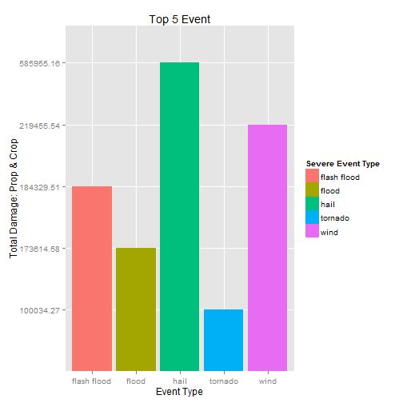

```r
library(dplyr)
library(gridExtra)
library(ggplot2)
```

```r
#url = "https://d396qusza40orc.cloudfront.net/repdata%2Fdata%2FStormData.csv.bz2"
#if(!file.exists("Assignment2")){
#        dir.create("Assignment2")
#}

#download.file(url, destfile="./Assignment2/stormdata.csv.bz2")
```
### **Cleaning data for analysis.**

```r
OriginalData <- read.csv("stormdata.csv.bz2")

#copying data 
intData <- arrange(OriginalData, EVTYPE)

#changing variable names and interested EVTYPE to to lower case.
names(intData) <- tolower(names(intData))
intData$evtype <- tolower(as.character(intData$evtype))

#copying data
cleanData <- intData

cleanData$evtype <- gsub("flash flooding", "flash flood", cleanData$evtype)
cleanData$evtype <- gsub("heavy rains|heavy rain/high surf", "heavy rain", cleanData$evtype)
cleanData$evtype <- gsub("flood/flash flood|flooding|flash flood/flood", "flood", cleanData$evtype)
cleanData$evtype <- gsub("freezing drizzle", "freezing rain", cleanData$evtype)
cleanData$evtype <- gsub("gusty winds", "gusty wind", cleanData$evtype)
cleanData$evtype <- gsub("heavy surf|heavy surf/high surf|high seas", "high surf", cleanData$evtype)
cleanData$evtype <- gsub("high wind|high wind and seas|high winds|high winds/snow|strong winds", "strong wind", cleanData$evtype)
cleanData$evtype <- gsub("hurricane erin|hurricane opal|hurricane/typhoon", "hurricane", cleanData$evtype)
cleanData$evtype <- gsub("tropical storm gordon", "tropical storm", cleanData$evtype)
cleanData$evtype <- gsub("wild/forest fire", "wild fires", cleanData$evtype)
cleanData$evtype <- gsub("winds", "wind", cleanData$evtype)
cleanData$evtype <- gsub("winter storm high winds|winter storms", "winter storm", cleanData$evtype)
cleanData$evtype <- gsub("winter weather/mix", "winter weather", cleanData$evtype)
cleanData$evtype <- gsub("landslides", "landslide ", cleanData$evtype)
cleanData$evtype <- gsub(".*tornado.*", "tornado", cleanData$evtype)
cleanData$evtype <- gsub(".*hail.*", "hail", cleanData$evtype)
cleanData$evtype <- gsub(".*heat.*", "heat", cleanData$evtype)
cleanData$evtype <- gsub(".*wind.*", "wind", cleanData$evtype)
cleanData$evtype <- gsub("riverflood|coastal flood", "flood", cleanData$evtype)
```

### Data Analysis
#### **Subetting data to visualize which weather phenomenal are most harmful with respect to population health. The data of interest here are fatalities and injuries.**


```r
#Grouping data frame by event type(evtype) and summing the total injuries & fatalities
summData <- aggregate(cbind(fatalities, injuries) ~ evtype, data = cleanData, sum)
#Set condition: Fatalities & injuries > 0
summData <- arrange(subset(subset(summData, fatalities>0), injuries>0), desc(fatalities), desc(injuries))
```

##### Subsetting data for plot. topInjuries and topFatalities include top 5 weather phenomenals that had caused the most casaulties and harm to our population.

```r
topInjuries <- arrange(summData[-2], desc(injuries))[1:5,]
topFatalities <- arrange(summData[-3], desc(fatalities))[1:5,]
```


####**Based on my findings, Tornado is the most harmful in respect to population health. Tornado causes the highest fatalities and injuries.**

```r
# Visualization of topInjuries and topFatalities
names(topInjuries)<- c("Event.Type","Injuries")
names(topFatalities) <- c("Event.Type", "Fatalities")
print(topInjuries)
```

```
##   Event.Type Injuries
## 1    tornado    91407
## 2       wind    11402
## 3       heat     9224
## 4      flood     6808
## 5  lightning     5230
```

```r
print(topFatalities)
```

```
##    Event.Type Fatalities
## 1     tornado       5661
## 2        heat       3138
## 3        wind       1421
## 4 flash flood        997
## 5   lightning        816
```

```r
p1 <- qplot(topInjuries$Event.Type, topInjuries$Injuries, geom ="histogram", stat="identity", fill = topInjuries$Event.Type) + xlab("Severe Event TYPE") + ylab("Number of injuries") + ggtitle("Top 5 injuries") + labs(fill="Severe Event Type")
p2 <- qplot(topFatalities$Event.Type, topFatalities$Fatalities, stat="identity",geom="histogram", fill =topFatalities$Event.Type) + xlab("Severe Event Type") + ylab("Number of fatalities") + ggtitle("Top 5 fatalities") + labs(fill="Severe Event Type") 

grid.arrange(p1,p2, nrow=2)
```

 

#### **Subsetting data to visualize which weather phenomenal have the greatest economic consequences.**

##### cleaning data for analysis.

```r
# Copying clean data to econ
econ <- cleanData
#Grouping data frame by event type(evtype) and summing the total property damage & crop damage
econ <- aggregate(cbind(propdmg,cropdmg) ~ evtype, data = econ, sum)
# Set conditions: property damange & crop damage > 0. Ordering highest to lowest damages
econSum <- arrange(filter(filter(select(econ, evtype, propdmg, cropdmg), propdmg>0), cropdmg>0), desc(propdmg), desc(cropdmg))
names(econSum) <- c('Event.Type','Property.Damage','Crop.Damage')
```

##### Subsetting data for plot. topProp and topCrop include top 5 weather phenomenals that had caused the highest number of property and crop damages.


```r
#Subsetting to show 5 five weather phenomenals with highest damages.
topProp <- arrange(select(econSum, Event.Type, Property.Damage), desc(Property.Damage))[1:5,]
topProp$Property.Damage <- as.factor(topProp$Property.Damage)
topCrop <- arrange(select(econSum, Event.Type, Crop.Damage), desc(Crop.Damage))[1:5,]
topProp$Property.Damage <- as.factor(topCrop$Crop.Damage)
print(topProp)
```

```
##    Event.Type Property.Damage
## 1     tornado       585954.16
## 2        wind       219451.54
## 3 flash flood       184326.51
## 4       flood       173612.58
## 5        hail       100029.27
```

```r
print(topCrop)
```

```
##    Event.Type Crop.Damage
## 1        hail    585954.2
## 2        wind    219451.5
## 3 flash flood    184326.5
## 4       flood    173612.6
## 5     tornado    100029.3
```

```r
tp_plot <- qplot(topProp$Event.Type, topProp$Property.Damage, geom="histogram", stat="identity", fill = topProp$Event.Type) + ylab("Total Damage: Properties") + xlab("Event Type") + ggtitle("Top 5 Events") + labs(fill="Severe Event Type")

tc_plot <- qplot(topCrop$Event.Type, topCrop$Crop.Damage/1000, geom="histogram", stat="identity", fill = topCrop$Event.Type) + ylab("Total Damage: Crops") + xlab("Event Type") + ggtitle("Top 5 Events") + labs(file = "Severe Event Type")

grid.arrange(tp_plot, tc_plot, nrow =2)
```

 

##### topDamage includes total damages from property and crop damages from the top 5 weather phenomenals. 

```r
topDamage <- merge(topProp, topCrop, by.x='Event.Type', by.y='Event.Type')
topDamage$Property.Damage <- as.numeric(topDamage$Property.Damage)
topDamage$Crop.Damage <- as.numeric(topDamage$Crop.Damage)
topDamage <- arrange(as.data.frame(cbind(topDamage$Event.Type, topDamage$Property.Damage+topDamage$Crop.Damage)), desc(V2))
names(topDamage) <- c("Event.Type", "Total.Damage")
topDamage$Total.Damage <- as.factor(topDamage$Total.Damage)
print(topDamage)
```

```
##    Event.Type Total.Damage
## 1        hail    585955.16
## 2        wind    219455.54
## 3 flash flood    184329.51
## 4       flood    173614.58
## 5     tornado    100034.27
```

####**Based on my findings, Hail damage have the greatest economic consequences.**

```r
td_plot <- qplot(topDamage$Event.Type, topDamage$Total.Damage, geom="histogram", stat="identity", fill = topDamage$Event.Type) + ylab("Total Damage: Prop & Crop") + xlab('Event Type') + ggtitle("Top 5 Event") + labs(fill = "Severe Event Type")

td_plot
```

 


library(knitr)
knit2html("stormAnalysis.Rmd")


